# Costs of mutability
## (in dynamic programming languages)

<div style = "height: 2em;"></div>

Michal Vlasák, 2023

---

# What is mutability?


```js
let o = { 1: "one" };
Object.freeze(o);
console.log(o);     // { '1': 'one' }
o = { 2: "two" };
console.log(o);     // { '2': 'two' }
```

Frozen object, but can be modified?

---

# What is mutability?

```js
const a = [ 1, 2 ];
console.log(a);     // [ 1, 2 ]
a[0] = 3;
console.log(a);     // [ 3, 2 ]
```


Constant variable, but can be modified?

---

# Two kinds of mutability

* Mutability of values (e.g. frozen vs normal object)

* Mutability of binding (`let` vs `const`)

---


```javascript
```

---

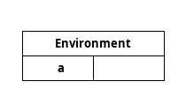

```javascript
let a = 1;
```

---

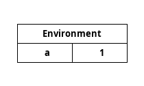

```javascript
let a = 1;
```

---

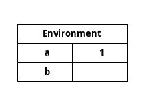

```javascript
let a = 1;
let b = a;
```

---


```javascript
let a = 1;
let b = a;
```

---


```javascript
let a = 1;
let b = a;
a = a + 1;
```

---

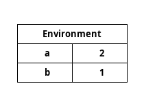

```javascript
let a = 1;
let b = a;
a = a + 1;
```

---


```js
let a = 1;
let b = a;
```

---


```js
let a = 1;
let b = a;
// mutate integer in place
a.increment();
```

---


```js
let a = 1;
let b = a;
// mutate integer in place
a.increment();
```

---


```js
let a = 1;
let b = a;
// mutate integer in place
a.increment();
```

---


```js
```

---


```js
let a = 1;
```

---

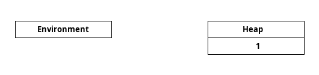

```js
let a = 1;
```

---


```js
let a = 1;
```

---


```js
let a = 1;
let b = a;
```

---

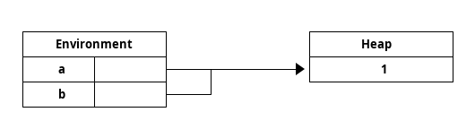

```js
let a = 1;
let b = a;
```

---


```js
let a = 1;
let b = a;
// mutate integer in place
a.increment();
```
---


```js
let a = 1;
let b = a;
// mutate integer in place
a.increment();
```

---

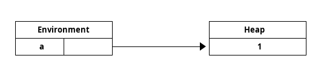

```js
const a = 1;
```

---


```js
const a = 1;
{
        const a = 2;
}
```

---

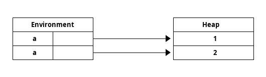

```js
const a = 1;
{
        const a = 2;
}
```

---

Typically:

1) assignment to local variable is a mutation of _binding_,

2) other mutations are mutations of _values_.

      - including assignments to an object fields or array indeces.


---

# Value representation

* Dynamic programming language
  - *values* have types
  - (vs static programming languages where *expressions* have types)

* Value is represented by pointer to heap
  - extra level of indirection for mutability
  - pass by reference

* For immutable data pass-by-value can be used

---

```c++
struct EnvironmentEntry {
	std::string_view name;
        Value value;
};

using Value = *HeapValue;

struct HeapValue {
        HeapValueKind kind;
};

enum class HeapValueKind {
        Integer,
        Array,
};
```

---

```c++

struct Integer : public HeapValue {
        int value;
};

struct Array : public HeapValue {
        int size;
        Value *array;
};

```

---

```c++
struct Array : public HeapValue {
        int size;
        Value *array;
};

struct HeapValue {
        HeapValueKind kind;
        union {
                int integer;
                Array array;
        } u;
};

```

---

# Python integers

* immutable

* but heap allocated

* costly for commonly used integers

* common integers preallocated (-5 through 256) 

* demo

---

# Interning / hash consing

* allocate at most one of each possible value of a type
   - e.g. each integer at most once

* saves memory
* cheap comparison (comparison of pointers)

* great for commonly used or commonly compared values

* Cons cells - LISP

---

# Strings

* Strings immutable and interned
  - e.g. Lua or (sometimes) Python

* Mutable
  - e.g. Ruby
  - demo

---

```ruby
k = "key"

hash = { k => "value" }

k.upcase!

hash[k]
hash["key"]
```

* Compares based on equality of values, not equality of pointers ("identity")

* But not always: http://jafrog.com/2012/10/07/mutable-objects-as-hash-keys-in-ruby.html

---

# Immutable strings

* Mutable strings have to be copied by hash maps
* Expensive copy, expensive comparison

* Ruby has immutable strings: "symbols" (`:string`)
  * two string types - complicated

---

# Closures

```js
function make_counter(initial) {
	let value = initial;

	function inc() { value += 1; }
	function get() { return value; }

	return { inc: inc, get: get };
}
```

 * bindings become shared

 * shared *and* mutable?
   * need a level of indirection

---


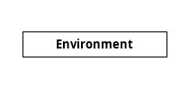

```js
function make_counter(initial) {


}
```

---


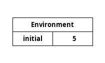

```js
function make_counter(initial) {


}
```

---


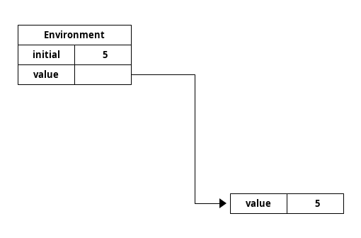

```js
function make_counter(initial) {
	let value = initial;


}
```

---


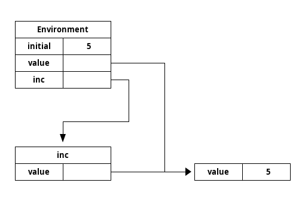

```js
function make_counter(initial) {
	let value = initial;

	function inc() { value += 1; }


}
```

---


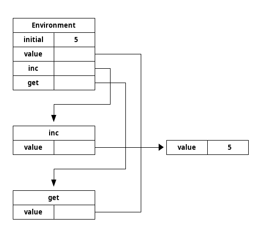

```js
function make_counter(initial) {
	let value = initial;

	function inc() { value += 1; }
	function get() { return value; }


}
```

---


```js
function make_counter(initial) {
	let value = initial;

	function inc() { value += 1; }
	function get() { return value; }

	return { inc: inc, get: get };
}
```

---


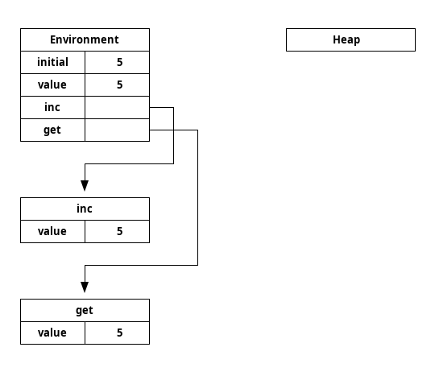

```js
function make_counter(initial) {
	const value = initial;

	function inc() { value.increment(); }
	function get() { return value; }

	return { inc: inc, get: get };
}

```

---


```js
function make_counter(initial) {
	const value = initial;

	function inc() { value.increment(); }
	function get() { return value; }

	return { inc: inc, get: get };
}
```

---

# Garbage collection

---

## Reference counting

* each object stores the number of references to itself

* object can be freed when counter reaches 0

---


---

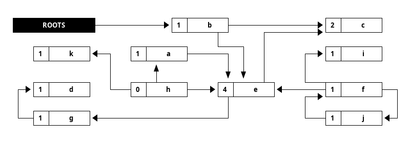

---


---

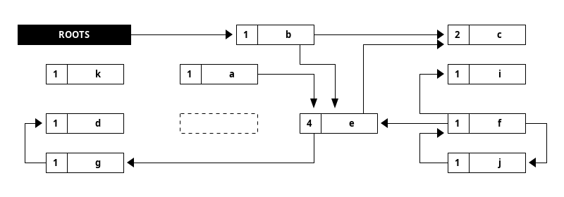

---


---


---


---

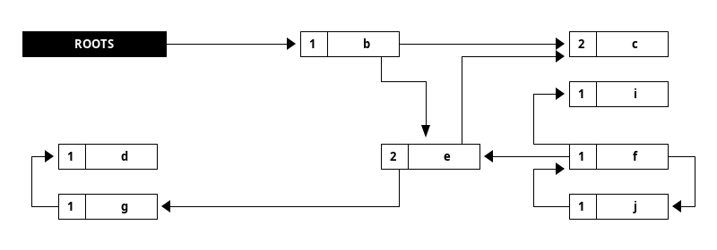

---

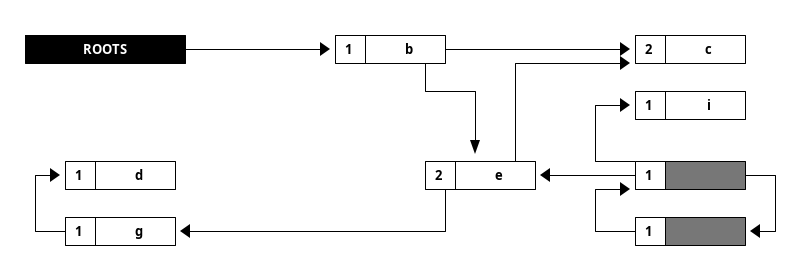

---


---

* If objects are immutable, there is no way to create cycles!

* But interestingly the immutable objects suddenly became mutable, because we added the reference count!

---

## Tracing

* Mark all reachable (potentially useful) objects recursively
  - start from trivially reachable objects, like local variables

* No problem with cycles
  - mark bit prevents visiting live objects twice
  - dead objects are never even visited

* Allows easily for defragmentation

---


---

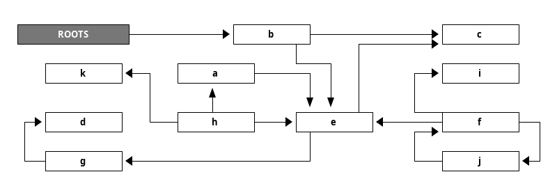

---

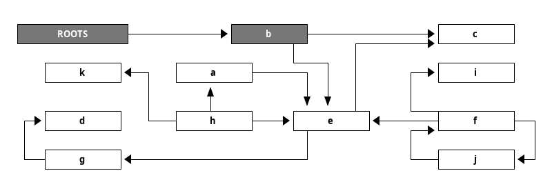

---

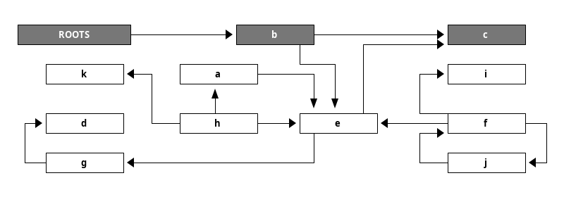

---

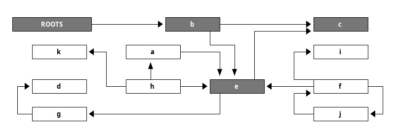

---

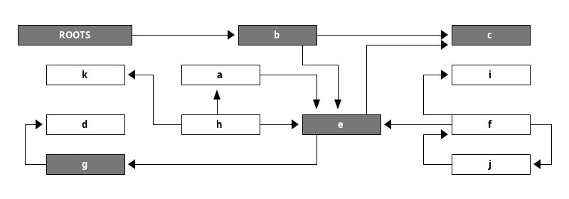

---


---

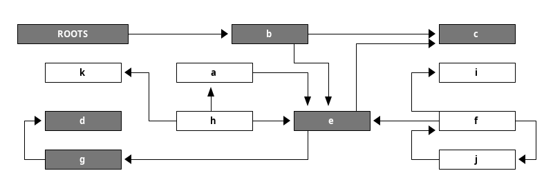

---

# Compaction

---


---

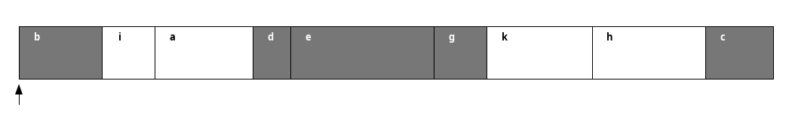

---

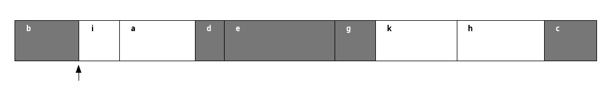

---

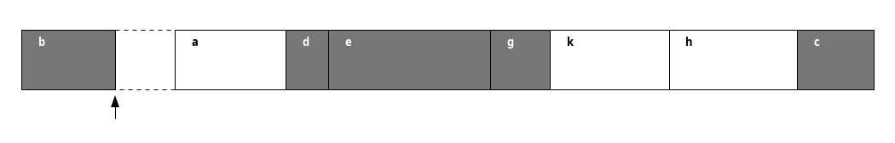

---

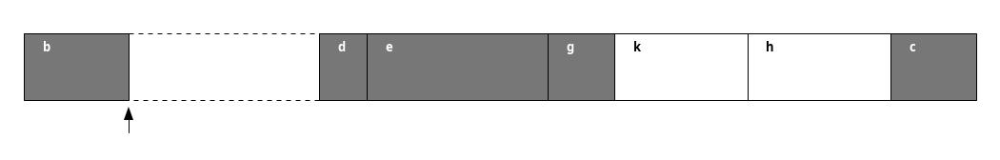

---

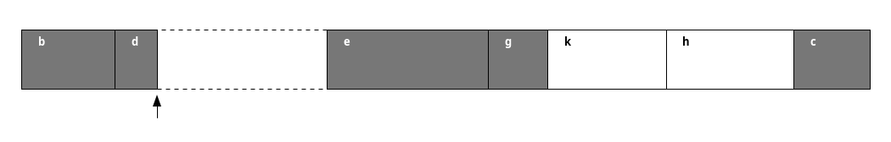

---

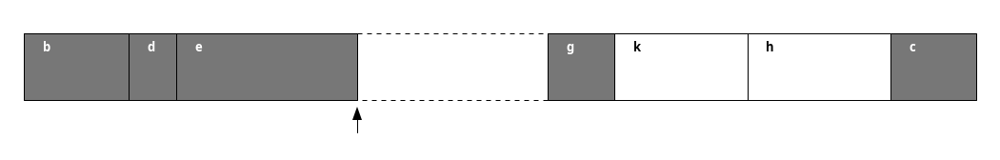

---

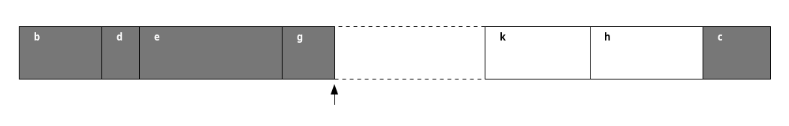

---

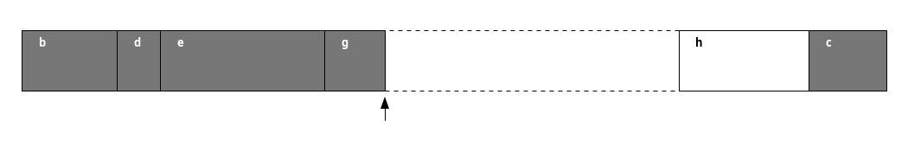

---

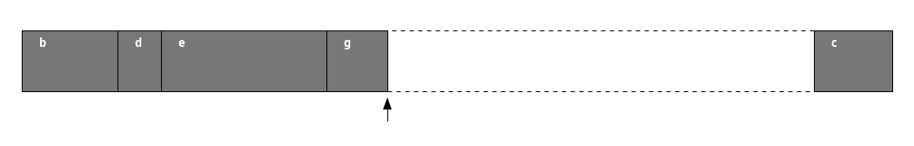

---


---


---

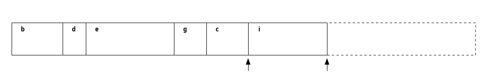

---

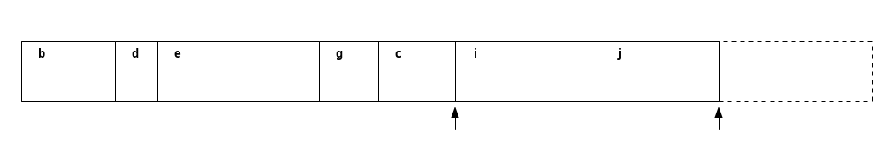

---

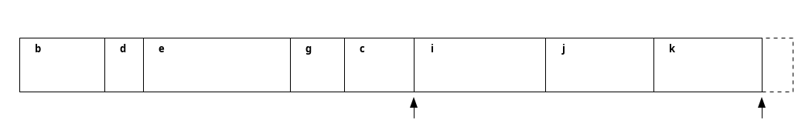

---

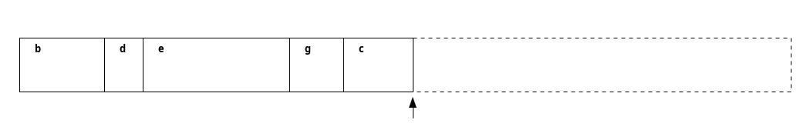

---


---

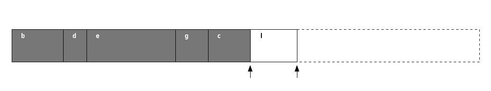

---

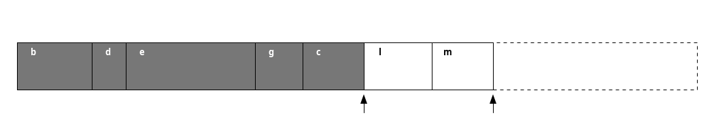

---

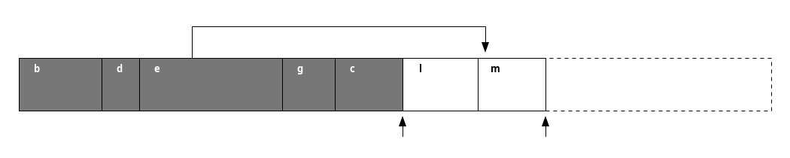

---

## Incremental / generational garbage collection

- Pointers from old objects to young objects fail our scheme

- Solutions:

  * Immutability - no old object can ever point to young object

  * Write barrier - check *all writes* for destroying invariants

* Mostly immutable values (e.g. Scheme)

 * with occasional writes, we can get away with expensive write barriers

 * map old space memory read-only

---

# Ultimate mutatation

Smalltalk's `become`:

 * `a become: b`

 * > all references to the object denoted by a before the call point refer to the object that was denoted by b, and vice versa

 * https://gbracha.blogspot.com/2009/07/miracle-of-become.html

 * Not as simple as:

    ```javascript
    var tmp = a;
    a = b;
    b = tmp;
    ```

---

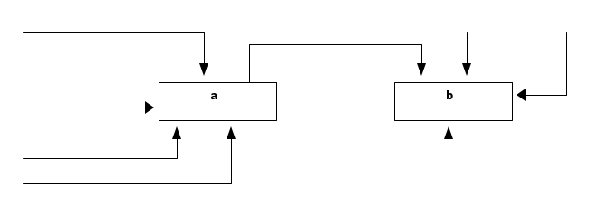

---


---

* Requires changing every pointer to those two objects.

* Crazy, complex...

* Why?

* There are some uses, but probably because it was easy.

---

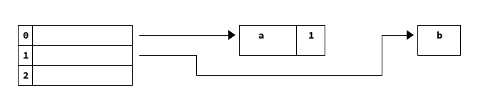

---

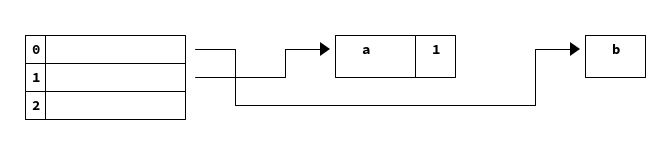

---

# Takeaways

* Mutability of values / bindings has a big impact on a design and implementation of a programming language

* Immutability makes a lot of things simpler

  * mutability sometimes needs an extra level of indirection

* > Every (mutability) problem can be solved with another layer of indirection.
